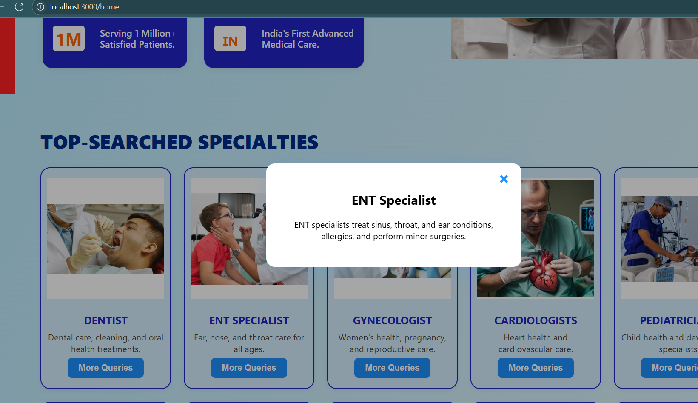
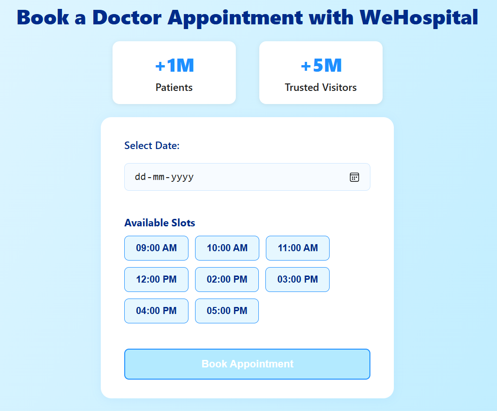
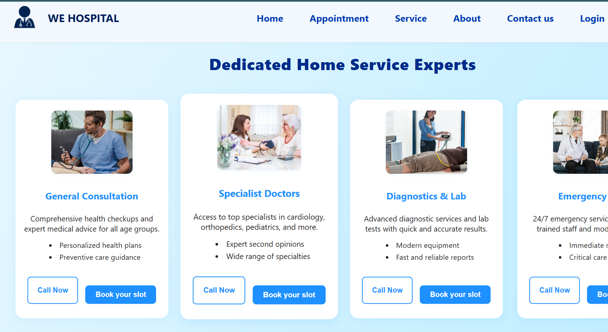
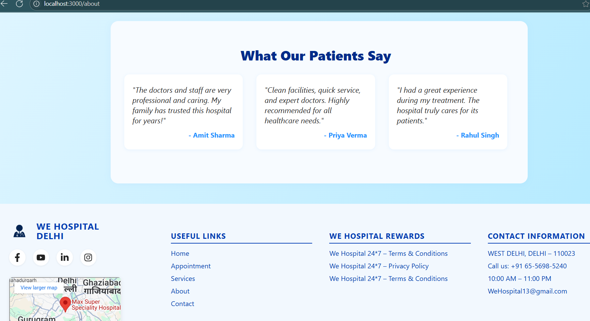
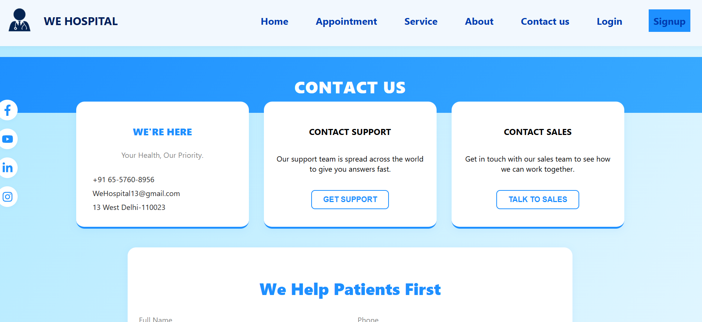

# Doctor Website 🩺

A responsive and modern Doctor Appointment website built using **HTML, CSS, JavaScript, and React**. This project allows users to explore services, book appointments, and contact healthcare professionals through a smooth and user-friendly interface.

## 🌟 Features

- 🏠 Clean and responsive homepage showcasing services and doctor details
- 📅 Appointment booking interface for users
- 🩺 Services page describing available medical specialties
- 🧑‍⚕️ About page with information about the clinic or doctors
- 📞 Contact form for queries and support
- 🔐 User authentication with login and signup pages
- 📱 Fully responsive and mobile-friendly design

## 🔧 Tech Stack

- **Frontend:** React, JavaScript
- **Styling:**  HTML, CSS
- **Routing:** React Router DOM

## 🚀 Getting Started

To run the project locally:
```bash
git clone https://github.com/Jasleen-Kaur-123/doctor-website.git
cd doctor-website
npm install
npm start
````

## 📸 Screenshots

### DOCTOR Home Page



### DOCTOR Appointment Page


### DOCTOR Service Page


### DOCTOR Login Page


### DOCTOR About Page


### DOCTOR Contact Page



